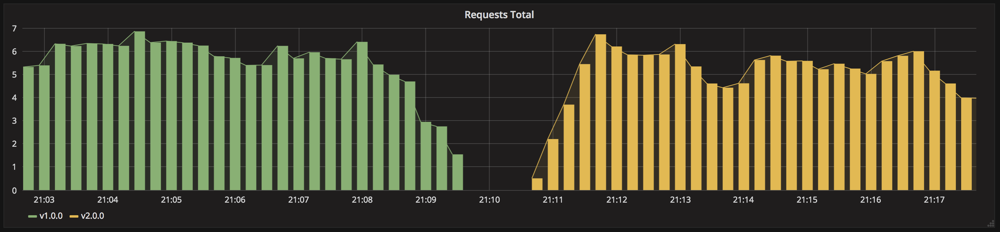
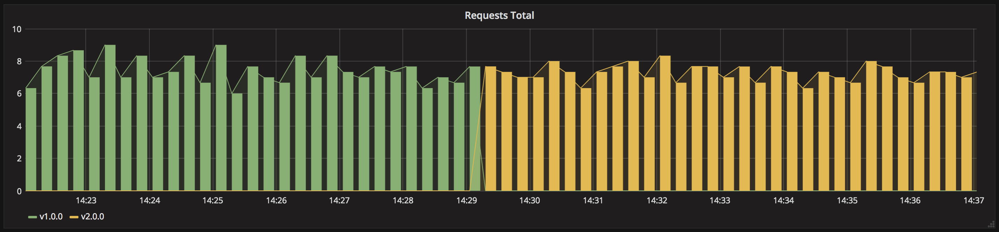
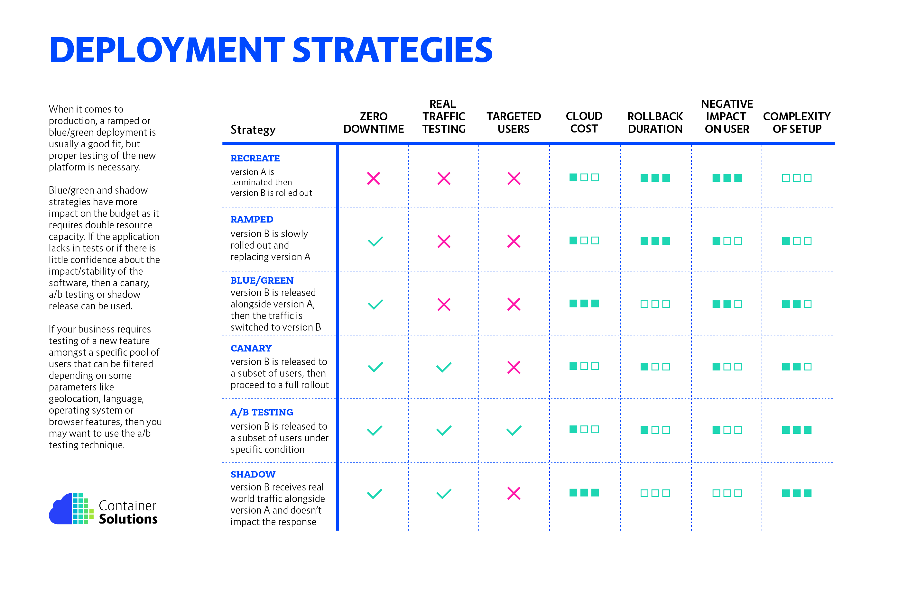

# Introduction to Kubernetes

Editors: **Kaan Keskin, Sezen Erdem**

Date: November 2021

Available at: https://github.com/kaan-keskin/introduction-to-kubernetes

**Resources:**

> - Kubernetes Documentation - https://kubernetes.io/docs/home/
> - Kubernetes in Action - Marko Lukša - Manning Publications
> - Kubernetes Fundamentals (LFS258) - Timothy Serewicz - The Linux Foundation
> - Kubernetes for Developers (LFD259) - Timothy Serewicz - The Linux Foundation
> - Kubernetes Lecture Notes - California Institute of Technology
> - Certified Kubernetes Application Developer (CKAD) Study Guide - Benjamin Muschko - O'Reilly Media
> - Getting Started with Kubernetes - Sander van Vugt - Addison-Wesley Professional

**LEGAL NOTICE: This document is created for educational purposes, and it can not be used for any commercial intentions. If you find this document useful in any means please support the original authors for ethical reasons.** 

[Return to the README page.](README.md)

# Kubernetes Deployment Strategies

In Kubernetes there is few different way to release an application, you have to carefully choose the right strategy to make your infrastructure resilient.

- **Recreate**: The Recreate strategy causes all old pods to be deleted before the new ones are created. Use this strategy when your application doesn’t support running multiple versions in parallel and requires the old version to be stopped completely before the new one is started. This strategy does involve a short period of time when your app becomes completely unavailable. Terminate the old version and release the new one. All existing Pods are killed before new ones are created when .spec.strategy.type==Recreate.

- **RollingUpdate**: Default strategy. The RollingUpdate strategy removes old pods one by one, while adding new ones at the same time, keeping the application available throughout the whole process, and ensuring there’s no drop in its capacity to handle requests. The Deployment updates Pods in a rolling update fashion when .spec.strategy.type==RollingUpdate. You can specify maxUnavailable and maxSurge to control the rolling update process.

- **Ramped**: Release a new version on a rolling update fashion, one after the other.

- **Blue/Green**: Release a new version alongside the old version then switch traffic.

- **Canary**: Release a new version to a subset of users, then proceed to a full rollout. If you want to roll out releases to a subset of users or servers using the Deployment, you can create multiple Deployments, one for each release.

- **A/B Testing**: Release a new version to a subset of users in a precise way (HTTP headers, cookie, weight, etc.). This doesn’t come out of the box with Kubernetes, it imply extra work to setup a smarter loadbalancing system (Istio, Linkerd, Traeffik, custom nginx/haproxy, etc).

- **Shadow**: Release a new version alongside the old version. Incoming traffic is mirrored to the new version and doesn't impact the response.

Before experimenting, checkout the following resources:
- [CNCF prensentation](https://www.youtube.com/watch?v=1oPhfKye5Pg)
- [CNCF prensentation slides](https://www.slideshare.net/EtienneTremel/kubernetes-deployment-strategies-cncf-webinar)
- [Kubernetes deployment strategies](https://container-solutions.com/kubernetes-deployment-strategies/)
- [Six Strategies for Application Deployment](https://thenewstack.io/deployment-strategies/).
- [Canary deployment using Istio and Helm](https://github.com/etiennetremel/istio-cross-namespace-canary-release-demo)
- [Automated rollback of Helm releases based on logs or metrics](https://container-solutions.com/automated-rollback-helm-releases-based-logs-metrics/)

